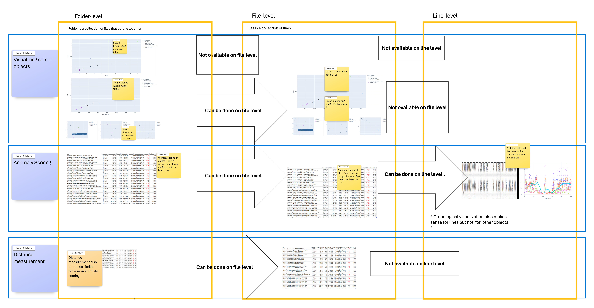

# LogDelta
LogDelta - Go Beyond Grepping with NLP-based Log Analysis! 

Textual log line level anomaly detection. Which ones are anomalies? 


See [YouTube](https://www.youtube.com/playlist?list=PLTUjKYPvVhe6JhHBlkJN_yPhVDR5w2ej2) demonstrating the tool in action.

## Installation and Example

There are two different starting points below — pick the one that matches what you're doing.
Don't run both `uv add logdelta` and `git clone` in the same directory: once you've cloned the
repo, its own `pyproject.toml` already declares `logdelta`, so trying to `uv add` it there fails
with a self-dependency error.

### Using LogDelta as a dependency in your own project

```bash
uv add logdelta
```
Or with `pip`:
```bash
python -m pip install logdelta
```

### Running the demo from this repo

Clone the repo and navigate to the demo folder — no separate install step needed, `uv run` syncs
the environment from the repo's own `pyproject.toml`/`uv.lock` on first use:
```bash
git clone https://github.com/EvoTestOps/LogDelta.git
cd LogDelta/demo
```
Get data
```bash
wget -O Hadoop.zip https://zenodo.org/records/8196385/files/Hadoop.zip?download=1
unzip Hadoop.zip -d Hadoop
```
Run analysis
```bash
uv run python -m logdelta.config_runner -c config.yml
```
Or with `pip` (after `pip install -e .` from the repo root):
```bash
python -m logdelta.config_runner -c config.yml
```

Observe results in `LogDelta/demo/Output`. 

For more examples see [LogDelta/demo/label_investigation](./demo/label_investigation) and [LogDelta/demo/full](./demo/full)

LogDelta assumes your folders represent a collection of software logs of interest. LogDelta performs a comparison between two or more folders using matching file names.  A **target run (folder)** represents a software run we are interested in analyzing. LogDelta uses **comparison runs (folder)** as a baseline. For example, the "My_passing_logs1", "My_passing_logs2", "My_passing_logs3" folders can be comparison runs, while "My_failing_logs" would be your target run that you want to analyze with respect to comparison runs.


## Types of Analysis
In LogDelta, three types of analysis are available:

1. **Visualize** 
   - Multiple logs files or runs with UMAP based on two dimensional scaling of the log contents. 
   - Individual log files with log anomaly scoring (see step 3 for details on supported anomaly detection methods)

2. **Measure the distance between two logs** using:
   - Jaccard distance
   - Cosine distance
   - Containment distance
   - Compression distance

3. **Anomaly scoring** where we first build an anomaly detection model from a set of logs and use it to score anomalies (higher scores more anomalous) in a log file using :
   - KMeans (kmeans)
   - IsolationForest (IF)
   - RarityModel (RM)
   - Out-of-Vocabulary Detector (OOVD)

Distance is always between pairs of objects. For example, between two folders, files, or even lines (line-to-line comparison does not make a lot of sense as there are simply too many pairs). Distance answers questions like which object is most similar to another object. 

Anomaly scoring is between a model and an object (folder, file, or line). The model is trained on multiple objects (folders, files, or lines). Trivia: we could say that anomaly scoring measures the distance between a set of objects and a target object. Anomaly scoring answers questions like which objects are suspicious based on their high anomaly scores.

## Levels of Analysis
Analysis can be done at four different levels:

1. **Folder level**, investigating the names of files without looking at their contents.
2. **Folder level**, investigating file contents (this is slower than what is done in 1).
3. **File level**, investigating file contents (matched with the same names between runs).
4. **Line level**, investigating line contents (matched with the same names between runs).

Conceptually:
1. **Folder** is a set of log files that belong together. Sets of log files can appear when our system runs multiple services that each output their own logs (e.g., billing.log, orders.log, complaints.log). What logs belong together depends on the context and can have many forms. Logs from different dates can belong together. For example, today we notice a problem, but the past 7 days we have had no problems in our system. At the folder level, we can compare today against the past 7 days, giving us 8 folders total: the target folder (today) and comparison/baseline folders (past 7 days). Another example can be test runs on different versions of the software. Let's say in testing we are working on the latest version. Then, we may want to compare logs produced by the latest version against logs from past versions.
2. **File** is a set of log lines that belong together. Lines that belong together typically orginate from a single system or service, e.g. billing.log.
3. **Line** is the atomic unit of single log line.    

## Valid compinations
Not all types of analysis make sense on all levels. Supported configurations are illustrated in the figure  


## Comparison to other tools. 
[logai](https://github.com/salesforce/logai). LogDelta shares many similarities with LogAI, a tool developed by Salesforce. However, the last time we checked, LogAI was not actively maintained. With some help from the issue tracker, we were able to get it running. However, our impression was that it was a bit on the slow side compared to LogDelta. LogDelta runs on top of Polars, which offers excellent performance for processing log files with more than ten million rows on a laptop computer. 

[angel-grinder](https://github.com/rcoh/angle-grinder) performs statistical analysis on log files, such as calculating the average response time in the logs. This is complementary to our tool as it allows analysis to be done within a single log file. Logdelta is not really useful for single log file analysis; rather, it requires 2 to n log files.

[lnav - Logfile navigator](https://lnav.org/) is advertised as a tool for merging, tailing, searching, filtering, and querying log files. This is a great complement to LogDelta. In fact, during our Hadoop use case, we implemented a small script for log querying, but we would likely have been much better off using lnav. 

[Loglizer](https://github.com/logpai/loglizer) performs anomaly detection on logs. The last commit was 18 months ago, so it might no longer be actively maintained. However, it assumes parsed log data (e.g., with Drain), whereas LogDelta accepts raw text files. Loglizer does not appear to offer any visualizations. It seems to be more focused on anomaly detection benchmarking and, in this sense, is similar to our previous tool, [LogLead](https://github.com/EvoTestOps/LogLead), which was published a year ago. LogDelta is build on top of LogLead[^1]. https://pypi.org/project/LogLead/


[^1]: Mäntylä MV, Wang Y, Nyyssölä J. Loglead-fast and integrated log loader, enhancer, and anomaly detector. In2024 IEEE International Conference on Software Analysis, Evolution and Reengineering (SANER) 2024 Mar 12 (pp. 395-399). IEEE.
